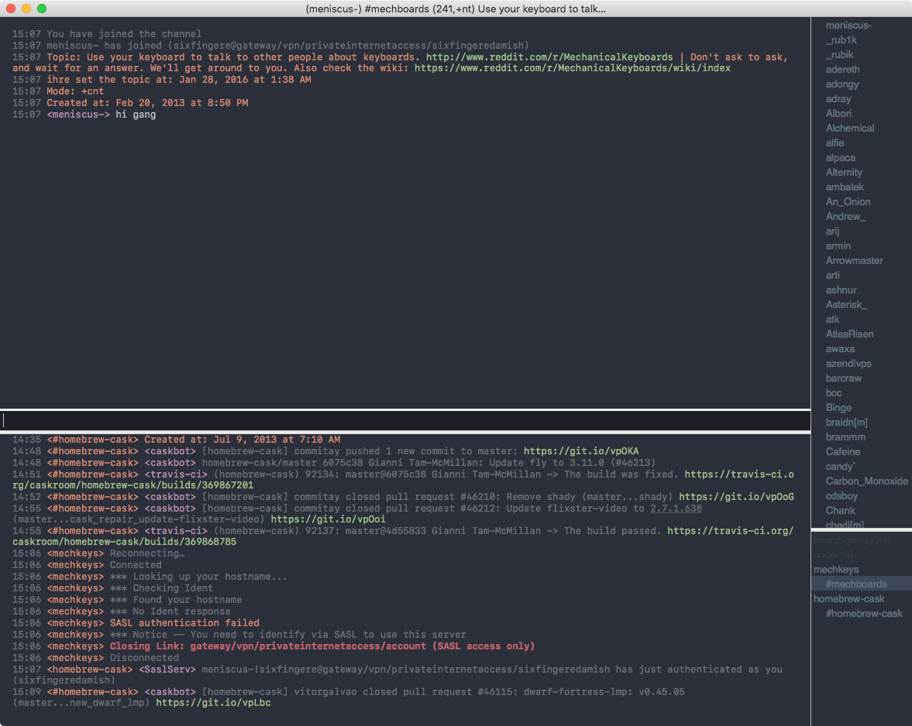

spacegrayish-limechat
=====================



[Spacegray](http://kkga.github.io/spacegray/)-ish  theme for [LimeChat](http://limechat.net/).

Some changes from [tkstnmr’s original](https://github.com/tkstnmr/spacegrayish-limechat):
- Uses Apple’s San Francisco Mono
- Added some breathing room to the body
- Fixed inactive server names being invisible

## Install

For regular version
```
cd ~/Library/Application\ Support/LimeChat/Themes/
git clone https://github.com/SixFingeredAmish/spacegrayish-limechat.git
ln -s spacegrayish-limechat/Spacegrayish.* .
```
For Mac App Store version
```
cd ~/Library/Application\ Support/net.limechat.LimeChat-AppStore/Themes/
git clone https://github.com/SixFingeredAmish/spacegrayish-limechat.git
ln -s spacegrayish-limechat/Spacegrayish.* .
```
(Optional) Installing the font

Please note that the San Francisco font is only licensed for non-commercial used on macOS computers.

- Navigate to `files/fonts/`
- Install each font file. 